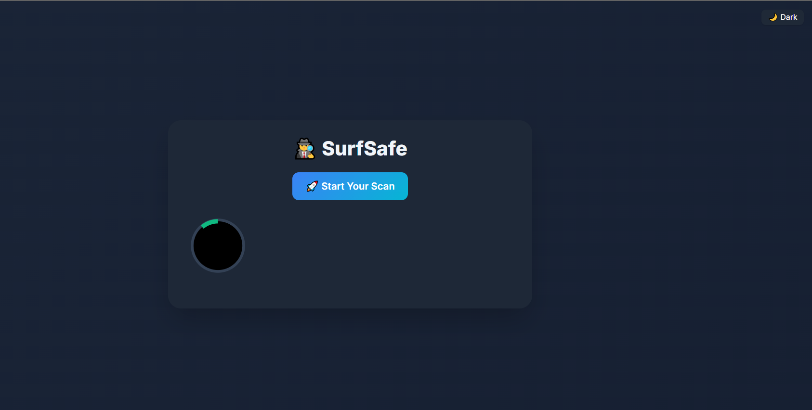

# 🕵️ SurfSafe

**SurfSafe** is a modern, browser-based tool that scans your environment to reveal how much personal information your browser may be exposing. It provides an intuitive privacy report powered by real-time detection using native web APIs — all without needing any installations.

---

## 🚀 Live Demo

🔗 **Working Link**: [Try It Yourselfl](https://surfsafe.netlify.app/)

<!-- Replace # with your hosted project link -->

---

## 🔍 What It Does

- 🕶️ Detects **Incognito/Private Mode**
- 🆔 Generates a lightweight **Browser Fingerprint**
- 🎥 Checks **Camera, Microphone, and Location** permission status
- 🌐 Displays **Browser**, **OS**, **Device**, **IP Address**, and **Timezone**
- 🔋 Reports **Battery Level**, **Language**, and **Screen Resolution**
- 📍 Retrieves **Approximate Geolocation** via IP

---

## 🎯 Why Use It?

Every time you browse, your device and browser silently expose data — some without asking. **🕵️ SurfSafe** empowers users to:

- Become aware of passive data leaks
- Evaluate device/browser security exposure
- Visualize their privacy risk using an intuitive ring meter

---

## ✨ Key Features

- ✅ **Animated Privacy Ring Meter** for visual exposure feedback
- ✅ Instant **Privacy Grade** (A+ to D)
- ✅ 🔁 **One-click Scan & Rescan**
- ✅ 🌓 **Dark / Light Theme Toggle**
- ✅ 📄 **Save Report as PDF**
- ✅ 🚀 Fully responsive UI built with **Tailwind CSS**

---

## 🖼️ Screenshot

  

)
